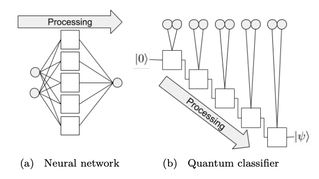
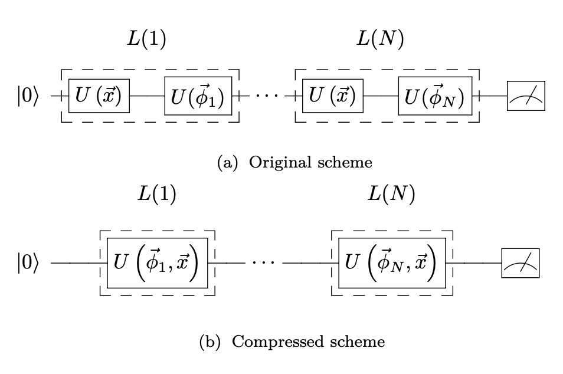
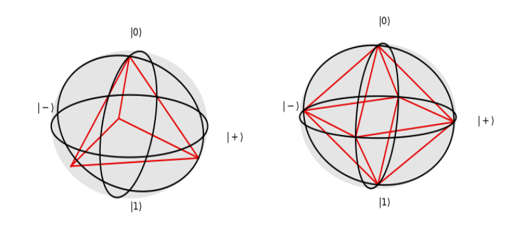
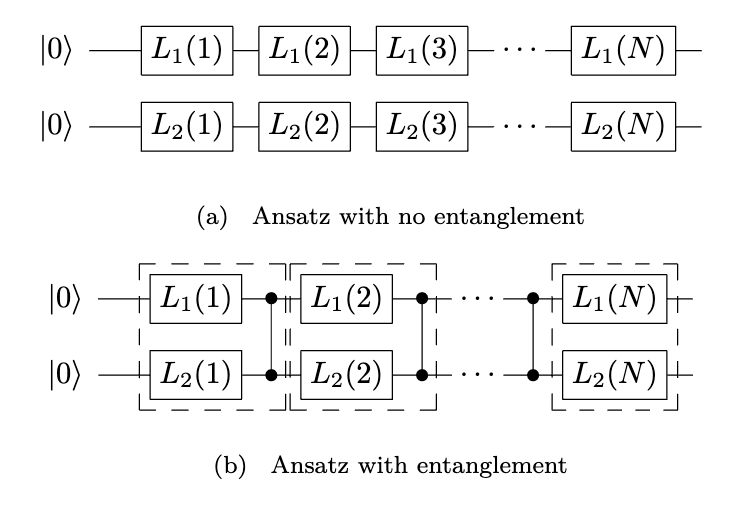
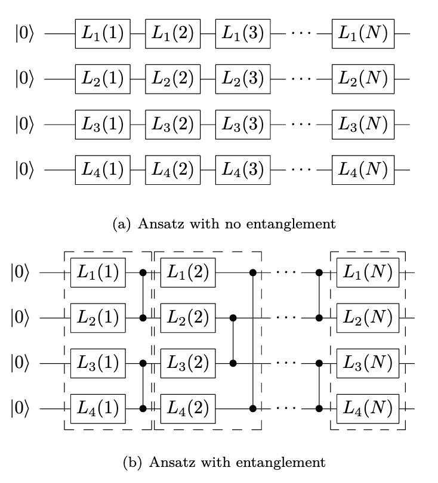

[[arXiv:1907.02085v3]](https://arxiv.org/abs/1907.02085)Data re-uploading for a universal quantum classifier
==============

Data re-uploading is considered as a manner of solving the limitations established by $ \textit{no-cloning teorem} $
> **DATA USING**
     NN : taking the same input many times when processing the data in the hidden layer neurons
     QNN : only using quantum data once.

Re-uploading classical data along a quantum computation to bypass this limitation on the quantum circuit

**Section 2**
 - Basic sturcture of a single-qubit quantum classifier
 - Data and processing parameters are uploaded and re-uploaded using one-qubit general rotation
 - Final state is compared with the target state
 - Parameters are updated by using classical minimiztion algorithm

**Section 3**
 - Data re-uploading approach by using 'Univesal Approximation Theorem' of ANN

**Section 4**
 - Extension of the classifier to multiple qubits

**Section 5**
 - Minimization method used to train the quantum classifier

**Section 6, 7**
 - Results and Conclusion

-----------------------------

### Section 2. Structure of a single-qubit quantum classifier

Quantum Circuit(QC) $\Leftarrow$ (*uploading of information onto a quantum state*) + (*processing of the quantum state*) + (*measurement of the final state*)

#### 2.1. Re-uploading classical information

It is not obvious to upload large amounts of data onto a state
 __Possible to consider a quantum circuit where all data are loaded in the coefficients of the initial wave function__
 Data - > Rotations of qubits in computational basis

> **Limitation** 
> Insufficient...for a single-qubit classifier 
>> 1. Only two degrees of freedom.
>> 2. Once the data is uploaded, the only quantum circuit available is a rotation in Bloch sphere.

Single rotation cannot capture any non-trivial seperation of patterns

[NN]Feed-froward neural network ; data are entered in a network in such a way that they are processed by subsequent layers of neurons 
[QNN]Building a universal quatum classifier with a single-qubit ; Re-uploading classical data
 
 

#### 2.2. Processing along re-uploading

The processing gates present int the circuit in terms of a classical set of parameters
 
 

 
 

The data is introduced in a simple rotation of the qubit

Using arbitrary single-qubit rotation $U(\phi_1, \phi_2, \phi_3)\in SU(2)$ writting $\vec{\phi} = (\phi_1, \phi_2, \phi_3)$
>**Universal Gate** 
>$\mathcal{U}(\vec{\phi},\vec{x}) \equiv U(\vec{\phi}_N)U(\vec{x}) \dots U(\vec{\phi}_1)U(\vec{x})$ 
>$\Rightarrow$ $\ket{\psi} = \mathcal{U}(\vec{\phi},\vec{x})\ket{0}$

The final calssification of pattrens will come from the results of measurements on $\ket{\psi}$

>**Processing Layer** 
> $L(i) \equiv U(\vec{\phi}_i)U(\vec{x})  \Longrightarrow \mathcal{U}(\vec{\phi},\vec{x}) = L(N)\dots L(1) $ 
> Circuit depth = $2N$

>**Compactifying the layer** 
> *Incoporate data and processing anles in a single step* 
> $\Rightarrow$ $L(i) = U(\vec{\theta}_i + \vec{\omega}_i \circ \vec{x})$ where $\vec{\omega}_i \circ \vec{x} = ({\omega_i^1}{x^1},{\omega_i^2}{x^2},{\omega_i^3}{x^3})$ 
> In this case the data points have dimension lesser than three, the rest of $\vec{x}$ components are $0$ 
> Circuit depth = $N$

Non-linearities comes from the structure of these base gates. 
Since of the structure of the gate, the encoding is particularly suited for data with *rotatational symmetry*

For further techniques, 
We can enlarge the dimensionality of the input space in the following way.  
$$L(i) = U({\vec{\theta}_i^{(k)}}+{\vec{\omega}_i^{(k)}} \circ {\vec{x}_i^{(k)}}) \cdots U({\vec{\theta}_i^{(1)}}+{\vec{\omega}_i^{(1)}} \circ {\vec{x}_i^{(1)}}) $$

#### 2.3. Measurement

Quantum circuit characterized by a series of processing angles {$\theta_i$} and weights {$\omega_i$} 
Making the final state $\ket{\psi}$, which needs to be measured

Computing $\chi^2$ that quantifies the error made in classification $\rightarrow$ Minimization of $\chi^2$

**Critical poin in the quantum measurement = (Finding an optimal way to associate outputs from the observation to targets)**
   
For single-qubit

The idea of maximal orthogonality of outputs (C. W. Helstrom, *'[Quantum detection and estimation theory](https://link.springer.com/article/10.1007/BF01007479)'*) 
$ \rightarrow $ **Dichotomic Classification**(2 classes problem)
> Output possibility ($P(0) for \ket{0}, P(1) for \ket{1}$)
>> $P(0)>P(1)$ : class A, $P(0)<P(1)$ : class B 
>> Or 
>> $P(0)>\lambda$ : class A, $P(0)<\lambda$ : class B

For many classes, 
- Comparing the probability $P(0)$ : for four sectors $ 0 \leq \lambda_1 \leq \lambda_2 \leq \lambda_3 \leq 1 $
- Computing the overlap of the final state to one of the states of a label states-set 
> This states-set is chosen with *maximal orthogonality* among all of them 
> Needs from maximally orthogonal points in the Bloch sphere 
> Example for four and six classes 
>
 
>
Good measurement tragedy may need some prior computational effort and refined tomography of the final state

***Single-qubit classifier $\rightarrow$ goemetry of the Bloch sphere**

##### 2.3.1. A fidelity cost function

Want to force the quantum states $\ket{\psi(\vec{\theta},\vec{\omega},\vec{x})}$ to be as near as possible to one particular state on Bloch sphere 
$\mapsto$ Angular distance between two states (M. A. Nielson and I. L. Chuang, *['Quantum Computation and Quantum Information'](https://www.amazon.com/Quantum-Computation-Information-10th-Anniversary/dp/1107002176)*) 
**Aim** : maximize the average fidelity between the states at the end of the circuit and the label states corresponding to their class

***Cost Function*** 

$\chi_f^2(\vec{\theta}, \vec{\omega}) = \sum_{\mu = 1}^M (1 - |\langle\tilde{\psi}_s | \psi(\vec{\theta}, \vec{\omega}, \vec{x}_{\mu})\rangle|^2)$ where $\ket{\tilde{\psi}_s}$ is the correct label state of the $\mu$ data point

##### 2.3.2 Weighted fidelity cost function

*Refined Version*  
$\ket{\psi}_c$ : label state where $c$ is the class 
$F_c(\vec{\theta}, \vec{\omega}, \vec{x}) = |\langle \tilde{\psi_c} | \psi(\vec{\theta}, \vec{\omega}, \vec{x})\rangle|^2 $ 
$ M $ : the total number of training point 
$ Y_c(\vec{x}) $ : Expected fidelity of a successful classification

> [Example] Four classes problem with fig3 
> $ Y_s(\vec{x}) = 1 $, where $s$ is the correct class, and $ Y_r(\vec{x}) = {1 \over 3} $ for the other $r$ classes 
> $ Y_c(\vec{x}) $ can be written as a verctor with the correct class, and the others containing the overlap between the correct class label and the other label states 
> $Y_c(\vec{x}) = (s = 1, r_1 = {1 \over 3},r_2 = {1 \over 3},r_3 = {1 \over 3})$ where the correct class is $s$   

***Weighted fidelity cost function***
$$ 
\chi_{\omega f}^2(\vec{\alpha},\vec{\theta}, \vec{\omega}) 
= 
{1 \over 2} \sum_{\mu = 1}^M
\left(
    \sum_{c=1}^C 
    \left(
        \alpha_c F_c(\vec{\theta}, \vec{\omega}, \vec{x_\mu}) - Y_c(\vec{x}_\mu)
    \right)
\right) 
$$

Difference between *fidelity cost function* and *weighted fidelity function* 
- How many overlaps do we need to compute
    - *weighted fidelity cost function* requires as many fidelities as classes every time we run the optimization subroutine
    - *fidelity cost function* needs just one
- Forcing the state...
    - *fidelity cost function* forces the parameters to reach the maximum in the fidelities; moves the qubit state to where it should be
    - *weighted fidelity cost function* forces the parameters to be close to a specified configuration of fidelities; moves the qubit state to where it should be and moves away from where it should not be

-----------------------------

### Section 3. Universality of the single-qubit classifier

Universal Approximation Theorem of aritificial neural network(Kurt Hornik, *['Approximation capabilities of multilayer feedforward networks](https://www.sciencedirect.com/science/article/abs/pii/089360809190009T)'*)

#### 3.1. Universal Approximation Theorem

>*Theorem* 
>Let $I_m = [0, 1]^m$ be the $m$-dimensional unit cube and $C(I_m)$ the space of continuous functions in $I_m$. 
>Let the function $\phi : \mathbb{R}  \rightarrow \mathbb{R}$ be a nonconstant, bounded and continuous function and $ f : I_m \rightarrow \mathbb{R} $ a function. 
>Then, for every $\epsilon > 0 $ there exists an integer $ N $ and a fucntion $ h : I_m \rightarrow \mathbb{R} $, defined as
>$$ h(\vec{x}) = \sum_{i=1}^N \alpha_i \phi(\vec{\omega}_i\cdot \vec{x}+b_i) $$
>with $ \alpha_i, b_i \in \mathbb{R}$ and $\vec{\omega}_i \in \mathbb{R}^m $, s.t. $h$ is an approximate realization of $f$ withe precision $\epsilon$,i.e.,
>$$|h(\vec{x})-f(\vec{x})| < \epsilon $$

In ANN, 
- $\phi$ : the activation function 
- $\vec{\omega}_i$ :  the weights for each neurons 
- $b_i$ : biases 
- $\alpha_i$ : the neuron wiehgts that construct the output function 

***It is possible to reconstruct any continous function with a single layer neural network of $N$ neurons***

#### 3.2. Universal Quantum Circuit Approximation

Decompostion of $SU(2)$ rotational matrix 
(PAPER)  
$$ U(\vec{\phi}) = U(\phi_1, \phi_2, \phi_3) = e^{i\phi_2\sigma_z}e^{i\phi_1\sigma_y}e^{i\phi_3\sigma_z}\underset{SU(2) \text{group composition law}}{\Rightarrow} U(\vec{\phi})=e^{i \vec{\omega}(\vec{\phi})\cdot \vec{\sigma}} \text{with} \vec{\omega}(\vec{\phi}) = \left( \omega_1(\vec{\phi}), \omega_2(\vec{\phi}), \omega_3(\vec{\phi}) \right) $$
and 
- $\omega_1(\vec{\phi}) = d \mathcal{N} \sin{((\phi_2-\phi_3) / 2)}\sin{\phi_1/2}$
- $\omega_2(\vec{\phi}) = d \mathcal{N} \cos{((\phi_2-\phi_3) / 2)}\sin{\phi_1/2}$
- $\omega_3(\vec{\phi}) = d \mathcal{N} \sin{((\phi_2+\phi_1) / 2)}\cos{\phi_1/2}$

where $\mathcal{N} = (\sqrt{1-\cos^2{d}})^{-1}$ and $\cos{d} = \cos{((\phi_2+\phi_3)/2)\cos{(\phi_1/2)}}$

Single-qubit classifier codifies the data points into $\vec{\phi}$ parameters of the $U$ unitary gate 
> Re-upload data together with the tunable parameters 
> $\vec{\phi}(\vec{x}) = (\phi_1(\vec{x}), \phi_2(\vec{x}), \phi_3(\vec{x})) = \vec{\theta} + \vec{\omega} \circ \vec{x}$  
> $\mathcal{U}(\vec{x}) = U_N(\vec{x})U_{N-1}(\vec{x}) \dots U_1(\vec{x}) = \prod_{j=1}^N e^{i \vec{\omega}(\vec{\phi_j}(\vec{x}))\cdot \vec{\sigma}}$ 
> Baker-Campbell-Hausdorff(BCH) formula 
> $\mathcal{U}(\vec{x}) = exp \left[ i \sum_{i=1}^N \vec{\omega}(\vec{\phi}(\vec{x}))\cdot\vec{x} + \mathcal{O}_{corr}\right]$ where $\mathcal{O}_{corr}$ are also proportional to Pauli matrices due to $[\sigma_i, \sigma_j] = 2i\epsilon_{ijk}\sigma_k$

 

Each $\vec{\omega}$ terms are trigometric functions(unconstant, bounded and continuous) 
$\sum_{i=1}^N \vec{\omega}(\vec{\phi}_i(\vec{x}))$  
$= \sum_{i=1}^N \left( \omega_1(\vec{\phi}_i(\vec{x})), \omega_2(\vec{\phi}_i(\vec{x})), \omega_3(\vec{\phi}_i(\vec{x})) \right)$  
$= \sum_{i=1}^N \left( \omega_1(\vec{\theta}_i + \vec{\omega}_i\circ\vec{x}), \omega_2(\vec{\theta}_i + \vec{\omega}_i\circ\vec{x}), \omega_3(\vec{\theta}_i + \vec{\omega}_i\circ\vec{x}) \right)$ 
$= (f_1(\vec{x}),f_2(\vec{x}),f_3(\vec{x}))$  

The remaining terms $\mathcal{O}_{corr}$ of BCH expansion($SU(2)$ group composition law) 
$>>>$ $\mathcal{U}(\vec{x}) = e^{i\xi(\vec{x})\cdot\vec{\sigma}}$ where $\xi(\vec{x})$ will be an inextricably trigometric function of $\vec{x}$
$$ \mathcal{U}(\vec{x}) = e^{i\xi(\vec{x})\cdot\vec{\sigma}} = e^{i\vec{f}(\vec{x})\cdot\vec{\sigma}+i\vec{\rho}(\vec{x})\cdot\vec{\sigma}}$$

With *weighted fidelity cost function*
The function obtained from the combination $\xi(\vec{x})$ and $\alpha_c$ is expected to be complex enough to probably represent almost any continuous function 
However, more parameters are necessary to map this argument with the UAT expression

Comparing the parameters
- $\vec{\omega}_i$ : the weights
- $\vec{\theta}_i$ : the biases $b_i$
- the number of layers $N$ : the number of neurons in the hidden layer
- $\vec{\omega}$ : the activation fucntion $\phi$

-----------------------------

### Section 4. Single- to multi-qubit quantum classifier

(???) Single-qubit classifier cannot carry any quantum advantage respect classical classification techniques s.t. ANN 

A huge amount of hidden neurons is necessary to approximate a target function with a single layer 
$\cdot$ More hidden layers $\rightarrow$ *deep neural network*

Generalization to multi-qubits 
Multiple qubits to quantum classifier may imporve its performance as more hidden layrers improve the classification task of an ANN work 
Entaglment $\longrightarrow$ reduce the number of layers of classifier as well as propose a qunatum classification method that can achieve quantum advantage

*The generalization of this analogy is not obvious* 
Multi qubit classifier $\sim$ CNN

#### 4.1. Measurement strategy and cost function for a multi-qubit classifier

If more qubirs are to be considered, tomography protocols become exponentially expensive in terms of number of measurement

**Measurement Strategy**
1. The natural generalization of the single-qubit strategy(Unrealizable for a large number of qubits) 
    $\rightarrow$ Comparing the final state with one of the states of the computational basis 
    Cost function = fidelity cost function 

2. Focusing in one qubit and depending on its state associate one or other class 
    $\sim$ Propsals of binary multi-qubit classifier 
    $+$ The possibility of multiclass classification 
    Cost function = weighted fidelity function...
    > ***Focusing on one qubit*** 
    > $$F_{c,q}(\vec{\theta}, \vec{\omega}, \vec{x}) = \langle \tilde{\psi}_c|\rho_q(\vec{\theta}, \vec{\omega}, \vec{x})|\tilde{\psi}_c\rangle$$
    > where $\rho_q$ is the reduced density matrix of the qubit to measured 
    > $$ \chi_{\omega f}^2(\vec{\alpha},\vec{\theta}, \vec{\omega}) 
= 
{1 \over 2} \sum_{\mu = 1}^M\sum_{c=1}^C
\left(
    \sum_{q=1}^Q 
    \left(
        \alpha_{c,q} F_{c,q}(\vec{\theta}, \vec{\omega}, \vec{x_\mu}) - Y_c(\vec{x}_\mu)
    \right)
\right) 
$$

#### 4.2. Quantum Circuit Example

For a multi-qubit quantum classifier, there is extra degree of freedom in the circuit-design 
Problem : There is no obvisous correct ansatz for the entangling structure of the circuit 

***Example***

-----------------------------

### 5.Minimization Method

To be precise, the set of $\{\theta_i\}$ angles, $\{\omega_i\}$ weghts, and together with $\alpha_{q,l}$ parmaeters, forms a space to be explored in search of a minimum $\chi^2$ 
Minimizing a function of many parameters 

- Single-qubit classifier
    - the number of parameters = $(3+d)N $ (d:dimension of the problem i.e. the dimenstionn of $\vec{x}$, $N$: the layers)

The minimizer is taken as a black box whose parameters are set by default

**Stochasitc Gradient Descent(SGD)** & **L-BFGS-B**

|   |SGD|L-BFGS_B|
|---|:---:|:---:|
|fidelity cost function|   | O |
|small training data|   | O |
|large trainging data| O |   |